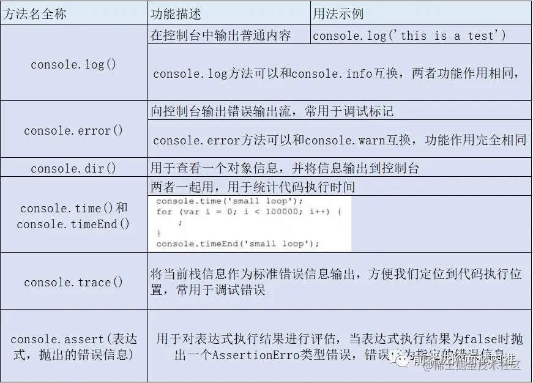

课程:https://juejin.cn/post/6863351989016166407

Node.js特点（记住三句话）
* 事件驱动
* 非阻塞IO模型（异步）
* 轻量和高效

# nodejs能解决什么问题
实现高并发用户连接
## 传统的非Node.js的高并发存在什么问题？
在Java、PHP或ASP.NET等服务器语言中，每一个客户端连接都会为其创建一个新的线程，而每个线程耗费大约需要2MB的内存，如果如果我们的服务器是8GB内存，那么理论上最多同时为4000个左右的用户提供服务。如果要想同时为更多的用户提供服务支持，就要增加服务器的数量，这样一来，硬件成本增加了，并且呢，不同服务器之间的数据共享问题也随之而来。所以，为每一个用户连接创建一个新的线程的方案，受服务器内存限制，成为了高并发连接的瓶颈

## Node.js是通过什么改进解决掉这个问题的呢
Node.js为了解决高并发连接问题，放弃了“为每一个用户连接创建一个新线程”的思想，改成为每一个用户连接在Node.js内部，触发一个事件。这就解决了多个用户连接耗尽服务器内存的问题。至于触发了一个什么事件、如何触发的，我们留到后面在讨论。

Node.js还有一个事件循环机制
Node.js中的事件循环机制与JavaScript中的事件循环机制很像，但是又有差异，多出了setImmediate 和 process.nextTick这两种异步方式，这些我们后面细讲，这里只要知道：Node.js具有事件循环机制的特点，并且呢，Node.js能实现高并发也是因为其独特的事件循环机制，这种机制与JavaScript中的事件循环机制有相同也有不同，就可以了，暂不深入去考虑。

# Nodejs作为服务器适合的场景
程序需要处理大量并发的输入输出时，并且再向服务端发送请求后，等待返回结果的这段时间内，不需要处理非常复杂的逻辑。
项目示例：
1）聊天服务器；同一时刻可能存在大量并发连接，而服务器端本身不存在非常复杂的处理。
2）电商类服务器：秒杀、抢购、准点开卖等场景。


# 导入导出

```js
exports.Foo = function(){ return 'foo' }
```
```js
const foo = require('/foo.js') // 引入模块
foo.Foo() // 访问模块内的Foo函数
```


# nodejs核心模块

| 模块名称    | 功能                 |
| ----------- | -------------------- |
| http        | 提供http服务器功能   |
| url         | 解析url              |
| fs          | 与文件系统交互       |
| querystring | 解析url查询字符串    |
| utils       | 提供一系列使用小工具 |
| path        | 处理文件路径         |


# REPL
> Read Eval Print Loop:交互式解释器
* 使用_来访问最近一次的表达式
* .help列出命令列表



setTimeout方法与setInterval方法均返回一个定时器对象，Node.js为这两个定时器对象各添加了unref和ref方法

unref和ref是浏览器环境下没有的
* unref方法用于取消setTimeout方法与setInterval方法中callback回调函数的执行；
* 而ref作用正好相反，用于恢复调用callback回调函数。

```js
const timer = setInterval(callback, ms, [arg], [...]) 
// setTimeout、setInterval都定时器返回一个定时器对象
timer.unref() // 取消callback函数的执行
timer.ref() // 恢复callback函数的执行
```
unref()和ref()方法取消回调和恢复回调只是取消和恢复了定时器对象中的回调函数，并不影响定时器的存在，要想清理定时器依然还是用clearInterval或clearTimeout。

同一个模块，首次加载后将缓存在内存中，此后，对于相同模块的多次引用，得到的都是同一个模块，不会引起模块内代码的多次执行。
这里会有一个问题：如果在多处引入了某个模块，由于首次引入后，后续将从内存中直接读取，所以，当我们修改模块内容时并不会引起引入模块的代码更新，可我每次都想用最新的模块内容，怎么办呢？
稍后我们在require.cache讲解中说到解决方案。这里先接着介绍require.

如果传给require的参数是一个模糊的文件名，不含有文件类型，这个时候，输出结果又会如何？
```js
const foo = require('foo') // 只传一个字符串形式名称，不指定文件类型
```
传给require的参数是一个模糊的文件名，Node.js并不会直接报错，而是有一套查找规则，总结如下
1. 先加载文件，优先级为：.js > .json >.node
2. 没有文件加载文件夹：
* 先看有没有package.json，有的话，加载package.json里main属性指定的文件。
* 没有package.json，加载该目录下的index.js文件


require.resolve()方法并不会引入该模块，更不会执行模块内方法，只是查找模块的完整绝对路径。

// TODO: https://juejin.cn/post/6868083707383644168

在Node.js中，事件主要是在模块对象与模块对象直接产生的，例如：接收到客户端请求、产生连接错误等等。

Node.js中，定义了一个处理事件的模块，这个模块叫event，这个模块中有一个类，EventEmitter。

//https://juejin.cn/post/6871437065754509325

node学习资料//https://cnodejs.org/getstart

## 非阻塞I/O（异步I/O）
众所周知，Node.js 是以单线程的模式运行，Node.js 不为每个客户连接创建一个新的线程，而仅仅使用一个线程。当有用户连接了， 就触发一个内部事件，通过非阻塞 I/O、事件驱动机制，让 Node.js 程序宏观上也是并行的。使用 Node.js，一个 8GB 内存的服务器，可以同时处理超过 4 万用户的连接。
> Node不会去等一段异步代码执行后的结果再去执行下面的代码，也就是说不会因为一段代码的逻辑错误，从而导致其他代码无法运行。这就是Node非阻塞I/O模型。

?
事件驱动
* Node.js使用事件驱动模型，当server收到请求，就关闭请求然后处理，接着处理下一个web请求。
* 当一个请求完成，它会返回处理队列，直到队列开头，会被返回给用户。
* 因为server一直接受请求而不等待任何读写操作，该模型非常高效，拓展性强。
* 会有一个主循环来监听事件，当检测到事件时触发回调函数。

设置content-type
```js
let http = require('http')
let server = http.createServer()
server.on('request', (req, res) => {
  let url = req.url
  if (url === '/') {
    res.setHeader('Content-Type', 'text/html; charset=utf-8') 
    // 配置相应头的content-type为text/html（含中文，必须加上编码格式utf-8）
    res.end('<p>首页</p>') // 响应内容
  }
})
server.listen(3000, () => {
  console.log('server is running>>>')
})
```


pnpm i @types/node -D

fs的readFile是以node的运行位置为根路径的

WHATWG  
Web Hypertext Application Technology Working Group  
网页超文本应用技术工作小组

IncomingMessage类  
https://www.bookstack.cn/read/nodejs-api-doc-cn/http-class_http_IncomingMessage.md  
https://www.w3schools.com/nodejs/obj_http_incomingmessage.asp

上方是旧版的url

```javascript
┌───────────────────────────────────────────────────────────────────────────────┐
│                                       href                                    │
├────────┬──┬─────────────────┬────────────────────┬───────────────────────┬────┤
│protocol│  │      auth       │         host       │         path          │hash│
│        │  │                 ├───────────────┬────┼────────┬──────────────┤    │
│        │  │                 │   hostname    │port│pathname│    search    │    │
│        │  │                 │               │    │        ├─┬────────────┤    │
│        │  │                 │               │    │        │ │   query    │    │
" https:  //   user  :  pass  @sub.example.com:8080 /p/a/t/h ? query=string #has"
│        │  │        │        │   hostname    │port│        │              │    │
│        │  │        │        ├───────────────┴────┤        │              │    │
│protocol│  │username│password│         host       │        │              │    │
├────────┴──┼────────┴────────┼────────────────────┤        │              │    │
│  origin   │                 │        origin      │pathname│    search    │hash│
├───────────┴─────────────────┴────────────────────┴────────┴──────────────┴────┤
│                                       href                                    │
└───────────────────────────────────────────────────────────────────────────────┘
(All spaces in the "" line should be ignored. They are purely for formatting.)
```

下方是新版的url

新版url需要使用new URL  
```js
const myURL = new URL('/foo', 'https://example.org/');
// https://example.org/foo
```

new URL().searchParams => 获取对应的searchParams对象, 具体如下

```js
const myUrl = new URL('https://example.org/abc?foo=~bar');

console.log(myUrl.search);  // prints ?foo=~bar

// Modify the URL via searchParams...
myUrl.searchParams.sort();

console.log(myUrl.search);  // prints ?foo=%7Ebar
```


new URLSearchParams()
```js
let params;

params = new URLSearchParams('user=abc&query=xyz');
console.log(params.get('user'));
// Prints 'abc'
console.log(params.toString());
// Prints 'user=abc&query=xyz'

params = new URLSearchParams('?user=abc&query=xyz');
console.log(params.toString());
// Prints 'user=abc&query=xyz'
```
* urlSearchParams.get(name)
* urlSearchParams.getAll(name)
* urlSearchParams.has(name)
* urlSearchParams.keys()
* urlSearchParams.values()
* urlSearchParams.set(name, value)
* urlSearchParams.sort()

// 响应的数据类型必须是字符串或者二进制数据
    res.end(JSON.stringify(arr))

`path.resolve([...paths])`  
The path.resolve() method resolves a sequence of paths or path segments into an absolute path.  
传入一堆路径片段, 从右往左拼接, 直到拼接成一个完整的绝对路径后终止.
如果全部拼接完成后依然不是绝对路径(包括不传入path片段的情况), 在最左侧拼接一个当前路径, 最后规范化(删除尾部斜杠--除非解析结果为根目录)

```js
path.resolve('/foo/bar', './baz');
// Returns: '/foo/bar/baz'

path.resolve('/foo/bar', '/tmp/file/');
// Returns: '/tmp/file'
//最右侧参数就已经是绝对路径了, 所以用不上了

path.resolve('wwwroot', 'static_files/png/', '../gif/image.gif');
// If the current working directory is /home/myself/node,
// this returns '/home/myself/node/wwwroot/static_files/gif/image.gif'
//到最后也不是绝对路径,所以把当前路径拼接上了
```

path.join([...paths])方法使用平台特定的分隔符把全部给定的 path 片段连接到一起，并规范化生成的路径。

- __dirname： 获得当前执行文件所在目录的完整目录名
- __filename： 获得当前执行文件的带有完整绝对路径的文件名
- process.cwd()：获得当前执行node命令时候的文件夹目录名
